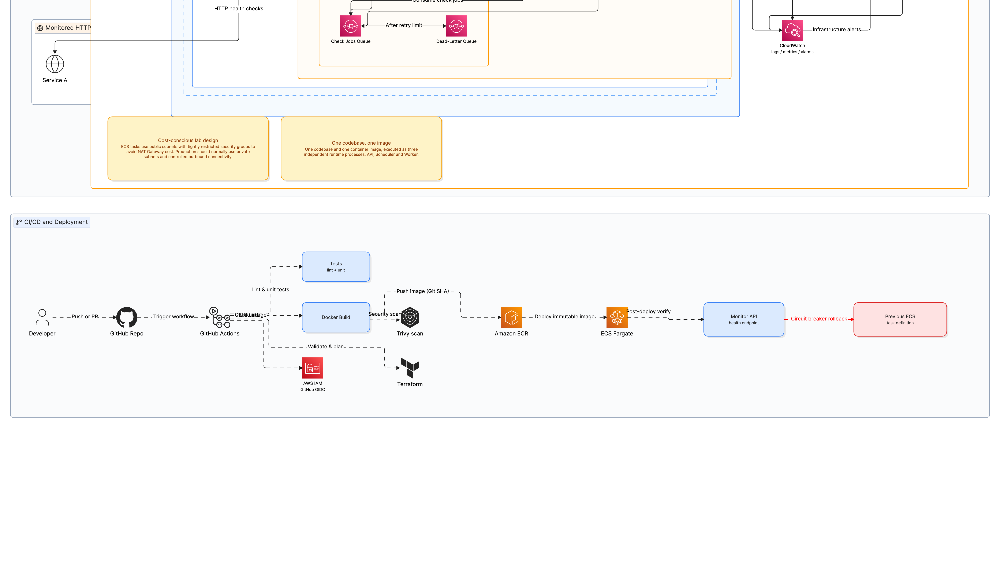

# aws-ecs-internal-service-monitor

[](https://github.com/mstrugarevic1/aws-ecs-internal-service-monitor/actions/workflows/pr.yml)

Small HTTP monitoring app designed for AWS ECS/Fargate.

It runs from one Docker image in three roles:

- API: dashboard, CRUD API, health/readiness endpoints
- Scheduler: queues checks for enabled monitors
- Worker: runs checks, stores results, and publishes alerts



## Current Status

Local mode works. AWS runtime adapters are implemented, but no AWS environment has been deployed from this repo yet.

- Local mode: in-memory repository, in-memory queue, log notifications
- AWS mode: DynamoDB, SQS, SNS when AWS env vars are present
- Terraform: infrastructure is prepared and validates locally

## Run Locally

Requirements:

- Python 3.12+
- Docker, only for container runs
- Terraform, only for infrastructure validation

```bash
make install
make test
make run-api
```

Open `http://127.0.0.1:8000/`.

Run with Docker:

```bash
make docker-build
make docker-up
make docker-down
```

## API Examples

Create a monitor.

```bash
curl -X POST http://127.0.0.1:8000/api/v1/monitors \
  -H 'content-type: application/json' \
  -d '{"name":"Example API","url":"https://example.com/health","expected_status":200,"timeout_seconds":5,"failure_threshold":3,"enabled":true}'
```

List monitors.

```bash
curl http://127.0.0.1:8000/api/v1/monitors
```

Queue a manual check.

```bash
curl -X POST http://127.0.0.1:8000/api/v1/monitors/MONITOR_ID/check
```

## Runtime Modes

Local mode needs no AWS credentials.

AWS mode is selected automatically when all of these are set:

```text
AWS_REGION
MONITORS_TABLE
CHECK_RESULTS_TABLE
QUEUE_URL
ALERTS_TOPIC_ARN
```

Before a real AWS deployment, configure remote Terraform state and enable the guarded deploy workflow. See [Deployment](docs/deployment.md).

## Validation

```bash
make lint
make typecheck
make test
make terraform-format
make terraform-validate
```

`make terraform-validate` needs access to `registry.terraform.io` to initialize providers.

## Docs

- [Architecture](docs/architecture.md)
- [Deployment](docs/deployment.md)
- [Security](docs/security-considerations.md)
- [Observability](docs/observability.md)
- [Limitations](docs/limitations.md)
- [Cost and Cleanup](docs/cost-and-cleanup.md)
