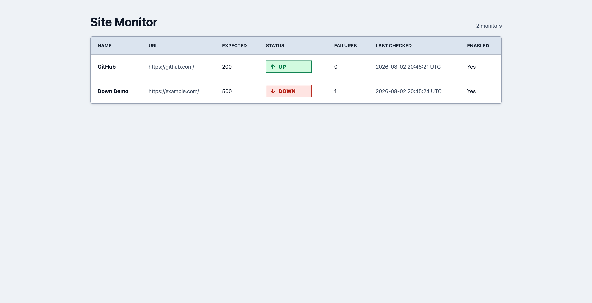

# Site Monitor

Site Monitor is a lightweight HTTP endpoint monitoring application built with FastAPI. It checks configured websites and HTTP service endpoints, records status codes and response times, stores results, and shows the latest state in a minimal server-rendered dashboard.

Repository identifier: `aws-ecs-site-monitor`.

## Architecture

The project is one Python/FastAPI codebase packaged into one Docker image with three runtime roles:

- API: serves the dashboard and monitor API, reads and writes monitor state, and enqueues manual checks.
- Scheduler: scans enabled monitors and sends check jobs.
- Worker: consumes jobs, runs HTTP checks, writes results, updates monitor state, and publishes alert or recovery notifications.

AWS runtime uses ALB, ECS/Fargate, EventBridge, SQS, DynamoDB, SNS, CloudWatch, and Terraform.


## Dashboard

The dashboard is intentionally minimal and server-rendered. It shows configured endpoints, expected HTTP status, current health, failure count, last check time, and enabled state.



## Features

- HTTP `GET` checks for websites, APIs, health-check endpoints, and HTTP-accessible services.
- Expected HTTP status validation.
- Response-time tracking.
- Configurable URL, expected status, timeout, failure threshold, and enabled state.
- Manual checks through the API.
- Scheduled checks in AWS through EventBridge.
- Background worker processing with SQS.
- DynamoDB monitor and result storage in AWS mode.
- SNS alert and recovery notification integration.
- Terraform-defined AWS infrastructure.

## How It Works

1. A monitor is created through the FastAPI API.
2. The scheduler enqueues check jobs for enabled monitors.
3. A worker sends an HTTP `GET` request to the configured URL.
4. The worker records HTTP status and request duration.
5. The worker compares the returned status with `expected_status`.
6. Results are stored and the latest monitor state is visible in the UI and API.

In Terraform, EventBridge runs the scheduler every five minutes. The current monitor model does not include a per-monitor interval.

## Adding a Monitor

The dashboard is read-only. Add monitors through the API, Swagger UI at `/docs`, or ReDoc at `/redoc`.

```bash
curl -X POST "http://127.0.0.1:8000/api/v1/monitors" \
  -H "Content-Type: application/json" \
  -d '{
    "name": "Example Website",
    "url": "https://example.com/",
    "expected_status": 200,
    "timeout_seconds": 5,
    "failure_threshold": 3,
    "enabled": true
  }'
```

Supported fields:

- `name`: required, 1 to 100 characters.
- `url`: required `http` or `https` URL with a hostname.
- `expected_status`: optional, 100 to 599, default `200`.
- `timeout_seconds`: optional, 1 to 30, default `5`.
- `failure_threshold`: optional, 1 to 10, default `3`.
- `enabled`: optional, default `true`.

URL validation rejects localhost, loopback, and link-local targets. Private IP targets require `ALLOW_PRIVATE_TARGETS=true`.

Unsupported per-monitor options: custom HTTP method, custom headers, request body, and per-monitor interval.

## FastAPI Application

FastAPI provides monitor creation, retrieval, update, deletion, manual checks, result retrieval, request validation, generated API docs, and the lightweight dashboard.

Enabled routes include:

- `GET /`
- `GET /healthz`
- `GET /readyz`
- `GET /version`
- `POST /api/v1/monitors`
- `GET /api/v1/monitors`
- `GET /api/v1/monitors/{monitor_id}`
- `PATCH /api/v1/monitors/{monitor_id}`
- `DELETE /api/v1/monitors/{monitor_id}`
- `POST /api/v1/monitors/{monitor_id}/check`
- `GET /api/v1/monitors/{monitor_id}/results`
- `GET /docs`
- `GET /redoc`

No React, Vue, Angular, or similar frontend app is required.

## Local Development

```bash
make install
make test
make run-api
```

Open `http://127.0.0.1:8000/`.

Local API, scheduler, and worker processes use separate in-memory state. Use AWS-backed runtime when roles need shared queue and repository state.

## Docker

```bash
make docker-build
make docker-up
make docker-down
```

The Compose API service exposes `http://127.0.0.1:8000/`.

## AWS Deployment

Terraform defines the target AWS environment, but this repository has not completed an AWS deployment.

```bash
make terraform-format
make terraform-validate
```

`terraform init -backend=false` needs provider registry access but not AWS credentials.

## Scope

Site Monitor is a focused reference implementation, not a commercial monitoring platform. The frontend is intentionally minimal so the project can focus on HTTP monitoring, backend workflows, AWS architecture, deployment, and infrastructure automation.

## Limitations

- AWS deployment has not been proven from this repository.
- No authentication or authorization is implemented.
- HTTPS, custom domain, and ACM certificate are not configured.
- Full SSRF protection is not implemented.
- Local API, scheduler, and worker processes do not share in-memory state.

## Documentation

- [Architecture](docs/architecture.md)
- [Local Development](docs/local-development.md)
- [Deployment](docs/deployment.md)
- [Observability](docs/observability.md)
- [Security Considerations](docs/security-considerations.md)
- [Limitations](docs/limitations.md)
- [Cost and Cleanup](docs/cost-and-cleanup.md)
- [Implementation Notes](docs/implementation-notes.md)
