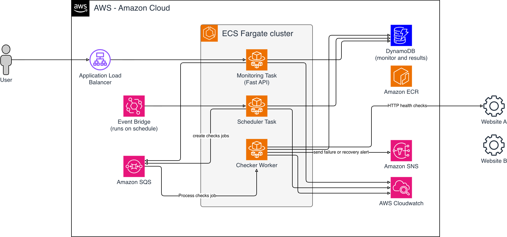

# Architecture

Site Monitor is one Python/FastAPI codebase packaged into one Docker image. The image can run in three roles: API, scheduler, or worker.



## Runtime Roles

- API service: serves the lightweight dashboard and monitor API, reads and writes monitor state, and enqueues manual checks.
- Scheduler task: scans enabled monitors and sends check jobs to the queue.
- Worker service: receives queued jobs, runs HTTP checks, writes result history, updates monitor status, and publishes alert or recovery notifications.

## Check Flow

```text
Client -> ALB -> API -> DynamoDB
                 |
                 +-> SQS

EventBridge -> Scheduler -> SQS -> Worker -> target HTTP endpoint
                                  |
                                  +-> DynamoDB
                                  +-> SNS
```

1. A user creates or updates HTTP endpoint monitors through the API.
2. The API stores monitor definitions and can enqueue a manual check.
3. EventBridge triggers the scheduler, which enqueues checks for enabled monitors.
4. Workers consume SQS messages and call the target HTTP endpoint with an HTTP `GET` request.
5. Workers store check results and update monitor state in DynamoDB.
6. Workers publish SNS notifications when a monitor crosses its failure threshold or recovers.

## Local Runtime

Local mode uses in-memory repository, queue, and notifier implementations. It requires no AWS credentials and is useful for API and service tests.

Each local process owns its own memory. Running API, scheduler, and worker as separate local processes does not create shared queue or repository state. Use the AWS-backed runtime when the roles need shared state.

## AWS Runtime

AWS mode is selected only when all required runtime variables are present:

- `AWS_REGION`
- `MONITORS_TABLE`
- `CHECK_RESULTS_TABLE`
- `QUEUE_URL`
- `ALERTS_TOPIC_ARN`

When those variables are set, the runtime uses DynamoDB, SQS, and SNS adapters.
